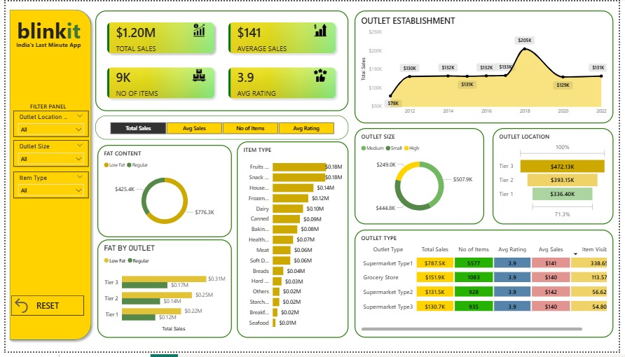
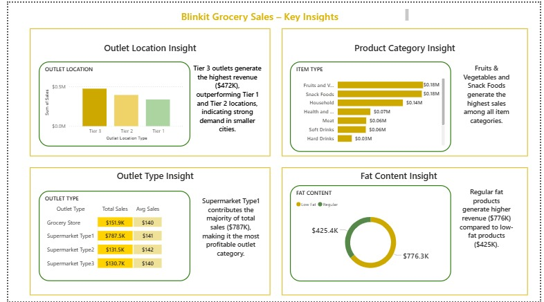

# Blinkit Sales & Outlet Performance Analysis (Power BI)

## Dashboard Preview


---

# Project Overview

This project analyzes Blinkit grocery sales data to uncover insights about outlet performance, product demand, and customer preferences.

An interactive dashboard was developed using Power BI to visualize sales distribution, outlet performance across locations, and product category trends.

The goal of this project is to demonstrate **data analysis, DAX calculations, and interactive dashboard development skills** using Power BI.

---

# Business Problem

Retail businesses like Blinkit need to understand which outlets, product categories, and customer preferences drive the most revenue.

Without clear insights, it becomes difficult to optimize inventory, improve product offerings, and maximize sales performance.

This dashboard analyzes grocery sales data to identify patterns in outlet performance, product demand, and customer satisfaction.

---

# Tools & Technologies

* Power BI
* Microsoft Excel
* Data Visualization
* Data Analysis
* DAX (Data Analysis Expressions)

---

# Dataset

The dataset contains grocery sales information including:

* Item Identifier
* Item Type
* Outlet Type
* Outlet Location Type
* Fat Content
* Item Rating
* Sales Value

Dataset location:

```
dataset/BlinkIT Grocery Data.xlsx
```

---

# Data Preparation

Before creating the dashboard, the dataset was prepared and structured in Power BI.

Data preparation steps included:

* Verifying data types
* Checking for missing values
* Creating calculated measures using DAX
* Organizing fields for analysis

---

# Key Performance Indicators (KPIs)

The dashboard tracks the following metrics:

* **Total Sales** – Total revenue generated from all items sold
* **Average Sales** – Average sales value per transaction
* **Number of Items** – Total number of items sold
* **Average Rating** – Average customer rating of products

A **dynamic metric selector (Field Parameter)** was used to allow switching between these KPIs within the same visualization.

---

# DAX Measures Used

### Total Sales

```DAX
Total Sales = SUM('BlinkIT Grocery Data'[Sales])
```

### Average Sales

```DAX
Avg Sales = AVERAGE('BlinkIT Grocery Data'[Sales])
```

### Number of Items

```DAX
No of Items = COUNT('BlinkIT Grocery Data'[Item Identifier])
```

### Average Rating

```DAX
Avg Rating = AVERAGE('BlinkIT Grocery Data'[Rating])
```

These measures power the KPI cards and support performance analysis across outlets, product types, and locations.

---

# Dashboard Features

The dashboard provides interactive visualizations to explore grocery sales performance.

Key features include:

* KPI cards displaying **Total Sales, Average Sales, Number of Items, and Average Rating**
* Dynamic **metric selector** for switching between KPIs
* Sales analysis by **Outlet Type**
* Sales distribution by **Outlet Location**
* Product category analysis by **Item Type**
* Comparison between **Low Fat and Regular Fat products**
* Interactive filters for deeper analysis

---

## Dashboard Screenshots

### Sales Overview


This dashboard page provides a high-level overview of Blinkit’s grocery sales performance.  
It highlights key performance indicators such as **Total Sales, Average Sales, Number of Items, and Average Rating**.  
The visualizations show how sales are distributed across **outlet types, outlet locations, and product categories**, helping identify which outlets and products contribute the most to overall revenue.

---

### Business Insights


This section of the dashboard focuses on deeper business insights derived from the data.  
It analyzes patterns in **fat content preferences, item categories, and outlet performance** to understand customer buying behavior.  
These insights help identify high-performing product segments and provide guidance for **inventory planning and product strategy**.

---

# Key Business Insights

* **Tier 3 outlets generate the highest revenue**
* **Supermarket Type 1 contributes the majority of total sales**
* **Regular fat products slightly outperform low-fat products**
* Certain product categories contribute significantly to total sales
* Higher-rated products tend to perform better in sales

---

# Project Structure

```
blinkit-sales_and_outlet_performance_analysis_powerbi-dashboard
│
├── dataset
│   └── BlinkIT Grocery Data.xlsx
│
├── dashboard
│   └── Blinkit Sales & Outlet Performance Analysis.pbix
│
├── screenshots
│   ├── Business Insights.jpeg
│   └── Sales Overview.jpeg
│
├── images
│
└── README.md
```

---

# Learning Outcomes

Through this project, the following skills were developed:

* Data visualization using Power BI
* Creating analytical measures using DAX
* Designing interactive dashboards
* Extracting business insights from retail data

---

# Future Improvements

Possible enhancements for this project include:

* Adding time-based sales trend analysis
* Implementing sales forecasting models
* Integrating additional retail datasets for deeper insights

---

# Author

Bharti
